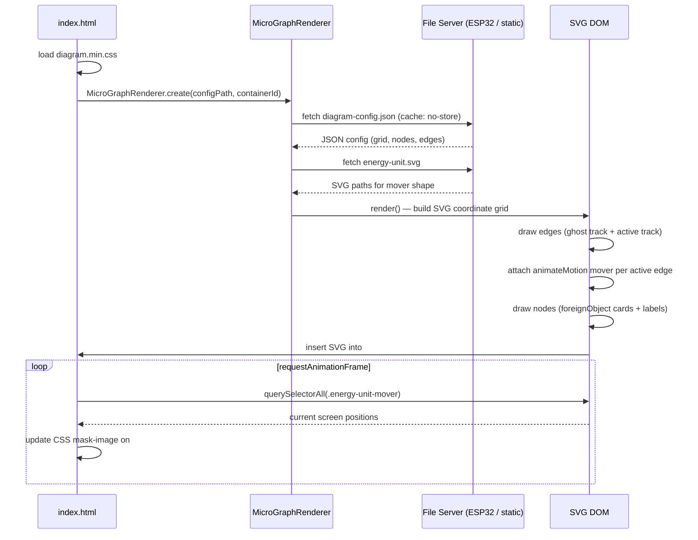

# MicroGraphRenderer — Energy Flow Diagram System

A zero-dependency, config-driven SVG energy flow diagram. Designed to run on an ESP32 web server (240 MHz, 520 kB RAM) with no build step, but equally usable in any static website context.

---

## Table of Contents

1. [System Overview](#1-system-overview)
2. [File Structure](#2-file-structure)
3. [How It Works — End to End](#3-how-it-works--end-to-end)
4. [The Config File](#4-the-config-file)
5. [Coordinate System and Grid](#5-coordinate-system-and-grid)
6. [Node Rendering](#6-node-rendering)
7. [Edge Rendering](#7-edge-rendering)
8. [Mover Animation (Energy Units)](#8-mover-animation-energy-units)
9. [Visual Effects Layer (diagram.css)](#9-visual-effects-layer-diagramcss)
10. [The SMIL Bridge (animations.js)](#10-the-smil-bridge-animationsjs)
11. [The Spotlight Highlight Effect](#11-the-spotlight-highlight-effect)
12. [Public API](#12-public-api)
13. [ESP32 Integration Guide](#13-esp32-integration-guide)
14. [Customization Reference](#14-customization-reference)
15. [Known Limitations](#15-known-limitations)

---

## 1. System Overview

The diagram renders a live energy-flow graph: nodes represent physical devices (solar panels, battery, wallbox, heat pump, etc.), edges represent energy channels between them, and animated "energy units" travel along those edges to visualize the direction and speed of power flow.

**Design constraints that drive every decision:**
- No npm, no bundler, no framework — single `<script src="">` tag deployment
- Must serve from an ESP32 flash filesystem (SPIFFS/LittleFS) over HTTP
- All visual configuration lives in one JSON file the microcontroller can rewrite at runtime
- Responsive and fluid via CSS scaling — no pixel-level layout logic

The system has four moving parts:

| Part | File | Role |
|---|---|---|
| Renderer | `src/scripts/micro-graph-renderer.js` | Reads config, builds the SVG DOM, runs animation |
| Config | `diagram-config.json` | Declares the graph (nodes + edges) |
| Styles | `assets/css/diagram.min.css` | All visual styling, VFX custom properties |
| SMIL Bridge | `src/scripts/animations.js` | Forwards CSS variable changes to SMIL attributes |

> **Development vs. deployment:** `src/diagram.css` is the Tailwind v4 source file and requires Node.js + Tailwind to compile. The compiled output `assets/css/diagram.min.css` is committed to the repository. For deployment — including on an ESP32 — only the compiled file is needed. There is no build step at deploy time.

---

## 2. File Structure

```
/
├── diagram-config.json                        ← graph definition (edit this to change the diagram)
├── src/
│   ├── scripts/
│   │   ├── micro-graph-renderer.js            ← core renderer class
│   │   └── animations.js                      ← SMIL bridge + scroll reveal
│   └── diagram.css                            ← source stylesheet (Tailwind v4 scoped)
├── assets/
│   ├── css/
│   │   └── diagram.min.css                    ← compiled output (committed, no build needed)
│   └── images/energy-diagram/
│       ├── energy-unit.svg                    ← the animated mover shape
│       ├── background-grid.svg                ← decorative background
│       ├── background-grid-highlighted.svg    ← highlighted background (used for spotlight)
│       ├── auto.svg
│       ├── battery.svg
│       ├── electric-meter.svg
│       ├── euro.svg
│       ├── solar-panel.svg
│       ├── stromnetz.svg
│       ├── waermepumpe.svg
│       ├── warp4-wallbox.svg
│       └── ...                                ← add more icons here
└── index.html                                 ← instantiation + spotlight loop
```

---

## 3. How It Works — End to End



---

## 4. The Config File

`diagram-config.json` is the single source of truth for everything about the graph. The renderer fetches it on init with `cache: 'no-store'` so an ESP32 can serve a fresh version on every page load.

### Full Schema

```jsonc
{
    "grid": {
        "width":  "3",   // number of columns
        "height": "3"    // number of rows
    },
    "graph": {
        "nodes": [
            {
                "id":          "n01",       // unique string ID, referenced by edges
                "position":    "(0,0)",     // grid cell (col, row), zero-indexed from top-left
                "label":       "Stromnetz", // text shown below the node card
                "icon":        "stromnetz.svg", // filename inside assets/images/energy-diagram/
                "highlighted": "false"      // "true" → blue gradient card style
            }
        ],
        "edges": [
            {
                "id":         "e01",        // unique string ID
                "source":     "n01",        // node ID of the start point
                "target":     "n02",        // node ID of the end point
                "status":     "active",     // "active" → animated mover; "inactive" → dimmed, no mover
                "speed":      0.7,          // 0–1 float; higher = faster animation
                "dotted":     "true",       // "true"/"false" → dashed stroke
                "icon":       "euro.svg",   // optional icon displayed at edge midpoint (empty = none)
                "icon-color": "#118c4f"     // optional CSS color applied to icon via SVG filter
            }
        ]
    }
}
```

### Speed Mapping

`speed` (0–1) maps nonlinearly to animation duration:

```
duration = ANIM_DUR_MAX − speed × (ANIM_DUR_MAX − ANIM_DUR_MIN)
         = 6 − speed × (6 − 0.3)  seconds
```

| speed | duration |
|-------|----------|
| 0.0   | 6.00 s   |
| 0.3   | 4.29 s   |
| 0.5   | 3.15 s   |
| 0.7   | 2.01 s   |
| 1.0   | 0.30 s   |

To make multiple edges look like they carry the same visual speed, give them the same `speed` value.

---

## 5. Coordinate System and Grid

The renderer uses an internal SVG coordinate space based on a fixed cell size:

```
CELL = 1000 SVG units per grid cell
```

A node at position `(col, row)` is centered at:

```
x = col × CELL + CELL/2
y = row × CELL + CELL/2
```

So a 3×3 grid spans `3000 × 3000` SVG units. The SVG `viewBox` is:

```
0 0 (cols × CELL) (rows × CELL + 300)
```

The extra `+300` on the height prevents bottom-row nodes from being clipped (their `box-shadow` extends below the cell boundary). The root SVG also has `overflow="visible"` for the same reason.

**All sizes in the renderer constants are in SVG units:**

| Constant | Value | Purpose |
|---|---|---|
| `CELL` | 1000 | Grid spacing |
| `R` | 300 | Node card radius (half-size for normal nodes) |
| `UNIT_W` | 600 | Mover width |
| `UNIT_H` | 28 | Mover height |
| `TRACK_W` | 14 | Edge stroke width |
| `LABEL_FS` | 55 | Label font size |
| `LABEL_OFFSET_Y` | 75 | Label distance below node center |
| `EDGE_ICON_SIZE` | 160 | Edge midpoint icon size |

Visual pixel sizes depend on how wide the container is. At the default `max-w-2xl` (~672 px) the scale is roughly **0.22 px per SVG unit**, so `CELL = 1000` ≈ 224 px on screen.

---

## 6. Node Rendering

Each node becomes an SVG `<g>` element containing two things:

1. **A `<foreignObject>` card** — HTML content (the icon) embedded in the SVG
2. **An SVG `<text>` label** — rendered below the card

### The BLEED Trick

`box-shadow` on an HTML element inside a `<foreignObject>` is clipped at the foreignObject boundary. The renderer works around this by expanding the `foreignObject` by `BLEED = 300` units on all sides, then adding a transparent `padding: 300px` wrapper inside that re-centers the visible card:

```
foreignObject  (x - R - BLEED,  y - R - BLEED,  (R + BLEED)×2,  (R + BLEED)×2)
└─ wrapper div  padding: 300px; box-sizing: border-box; pointer-events: none
   └─ outer div  .mg-node-outer  ← the visible card with border, shadow, background
      └─ inner div  .mg-node-inner
         └─ img  .mg-node-icon
```

The transparent padding means the `<foreignObject>` is much bigger than the card, but the card only occupies the center portion. This lets the shadow bleed outward freely.

### Highlighted Nodes

Setting `"highlighted": "true"` in the config:
- Increases the card size (`R` stays at 300 instead of being reduced to 225)
- Applies CSS classes `mg-node-outer--highlighted` and `mg-node-inner--highlighted` (blue gradient, inverted icon)

---

## 7. Edge Rendering

Each edge renders as an SVG `<g>` group containing:

1. **Ghost track** — a faint, thin copy of the path indicating the channel at rest
2. **Active track** — the main stroke; this is the `<path>` the mover rides
3. **Mover** (if `status === "active"`) — the animated energy unit
4. **Icon** (if `edge.icon` is set) — an `<image>` at the path midpoint

### Path Shape

Edges connect node centers. The `getBezierPath()` method returns:
- **Diagonal connections** (dx ≠ 0 and dy ≠ 0): a straight `L` line — avoids rotation artefacts on the mover
- **Axis-aligned connections**: a cubic Bézier `C` with control points at 50% of the dominant axis, creating a smooth curve

### Dotted Edges

When `"dotted": "true"`, both the ghost and active tracks receive `stroke-dasharray: "1 42"` (1 unit dash, 3× track-width gap). This is used for grid connections where money flows, not electrons.

### Edge Icons

An optional SVG image is placed at the geometric midpoint of the edge, offset 40 units above center. If `icon-color` is set, the renderer injects an inline SVG `<filter>` using `feFlood` + `feComposite` to tint the icon to the specified color.

---

## 8. Mover Animation (Energy Units)

Each active edge gets an animated "energy unit" — a small capsule shape that travels the track path continuously.

**Technology: SMIL `animateMotion`**

```xml
<g id="mg-mover-e01" class="energy-unit-mover">
  <animateMotion
    dur="2.01s"
    repeatCount="indefinite"
    rotate="auto-reverse"
    keyPoints="0;1"
    keyTimes="0;1"
    calcMode="linear"
  >
    <mpath href="#mg-track-e01" />
  </animateMotion>

  <g style="transform: scale(var(--mg-vfx-scale)); filter: blur(...) drop-shadow(...)">
    <svg x="-300" y="-14" width="600" height="28" ...>
      <!-- cloned paths from energy-unit.svg -->
    </svg>
  </g>
</g>
```

The mover uses `<mpath href="#mg-track-e01">` to follow the exact same `<path>` element that draws the visible track. `rotate="auto-reverse"` keeps the capsule aligned to the path tangent.

### Mover Shape

`energy-unit.svg` is fetched once on init. Its `<path>` elements are cloned into every mover's inner `<svg>`. The viewBox is preserved and the element is centered at origin (`x = -W/2, y = -H/2`) so it rides the track centered.

### VFX

A glow effect wraps the mover shape via CSS custom properties (see [Section 9](#9-visual-effects-layer-diagramcss)):

```
transform: scale(--mg-vfx-scale)
filter: blur(--mg-vfx-blur)
         drop-shadow(0 0 --mg-vfx-glow-near-spread --mg-vfx-glow-near-color)
         drop-shadow(0 0 --mg-vfx-glow-far-spread   --mg-vfx-glow-far-color)
```

> **Note:** `backdrop-filter` on node cards does **not** blur the SVG mover elements — this is a browser compositing constraint. The HTML `<foreignObject>` content and the SVG stacking context are composited separately.

---

## 9. Visual Effects Layer (diagram.css)

`src/diagram.css` is a Tailwind v4 stylesheet scoped exclusively to the diagram. It is compiled to `assets/css/diagram.min.css` and loaded as a separate `<link>` tag.

The `@source` directive points Tailwind at the renderer JS so it scans utility classes used there:

```css
@source "../src/scripts/micro-graph-renderer.js";
```

### VFX Custom Properties

All glow parameters are exposed as CSS variables on `:root` so you can override them per-page or at runtime:

```css
:root {
    --mg-vfx-scale:             0.65;              /* mover scale (< 1 = slightly smaller) */
    --mg-vfx-blur:              2px;               /* motion blur on mover */
    --mg-vfx-glow-near-spread:  20px;              /* tight inner glow radius */
    --mg-vfx-glow-near-color:   rgba(5,180,255,0.9);
    --mg-vfx-glow-far-spread:   40px;              /* wide outer glow radius */
    --mg-vfx-glow-far-color:    #5384FF;
}
```

### Key CSS Classes

| Class | Element | Purpose |
|---|---|---|
| `.mg-node-outer` | `foreignObject` wrapper div | Outer card: border, shadow, rounded background |
| `.mg-node-outer--highlighted` | same | Blue gradient variant for the featured device |
| `.mg-node-inner` | Inner content div | Light gradient background, flexbox centering |
| `.mg-node-inner--highlighted` | same | Dark blue gradient, icons inverted to white |
| `.mg-node-icon` | `` inside node | Sized to 60% of inner card, `filter: brightness(0)` for silhouette |
| `.mg-track` | SVG `<path>` | Edge stroke color |
| `.mg-track-ghost` | SVG `<path>` | 15% opacity overlay to indicate the channel |
| `.mg-label` | SVG `<text>` | Label below each node; 55 SVG units, responsive override at 480px |
| `.energy-unit-mover` | SVG `<g>` | The moving energy capsule group |

### Responsive Label Sizes

```css
.mg-label { font-size: 55px; }                          /* default */
@media (max-width: 480px) { .mg-label { font-size: 88px; } }  /* small screens */
```

SVG font-size is in SVG user units. The SVG scales down on narrow screens, so the effective pixel size shrinks. The `@media` override compensates by using a larger unit value.

---

## 10. The SMIL Bridge (animations.js)

SMIL `animateMotion` attributes (`dur`, `keyPoints`) cannot read CSS custom properties — they only accept literal values. `animations.js` solves this with a `MutationObserver` bridge:

```
updateEnergyFlow(watts)
    │
    └─ sets CSS vars on #main-flow-line:
           --flow-speed: "2.01s"
           --flow-direction: "normal" or "reverse"

MutationObserver watches #main-flow-line inline style
    │
    └─ on change, reads --flow-speed / --flow-direction
       → sets motionAnim.setAttribute('dur', speed)
       → sets motionAnim.setAttribute('keyPoints', '0;1' or '1;0')
       → calls svg.pauseAnimations() or svg.unpauseAnimations()
```

**`updateEnergyFlow(powerInWatts)`** is the runtime control function:

```js
updateEnergyFlow(0)      // pauses animation, dims the line
updateEnergyFlow(2400)   // forward flow, speed proportional to wattage (capped 0.3–6 s)
updateEnergyFlow(-800)   // reverse flow (discharging / exporting)
```

Speed formula: `Math.max(0.3, Math.min(5000 / Math.abs(watts), 6))` — at 5000 W the duration is exactly 1 s, at 1000 W it is 5 s.

> **Note for ESP32 use:** `#main-flow-line` and `#energy-motion-anim` are legacy IDs from an earlier single-edge design. The current multi-edge renderer manages `animateMotion` elements directly per edge. `updateEnergyFlow` is still useful if you wire it to a single representative edge for live watt-based speed control. For multi-edge control, use `applyConfig()` or call `setAttribute('dur', ...)` directly on `#mg-anim-{edgeId}` elements.

---

## 11. The Spotlight Highlight Effect

Behind the SVG canvas there are two stacked background layers:

```html
<div class="relative w-full"
     style="background: url('background-grid.svg') center / cover no-repeat;">

    <!-- Layer 1: highlighted version, starts fully hidden -->
    <div id="svg-diagram-highlight"
         style="position: absolute; inset: 0;
                background: url('background-grid-highlighted.svg') center / cover no-repeat;">
    </div>

    <!-- Layer 2: the actual SVG diagram (rendered by MicroGraphRenderer) -->
    <div id="svg-diagram-canvas"></div>
</div>
```

A `requestAnimationFrame` loop reads the screen position of every `.energy-unit-mover` element and punches circular holes in the highlight layer using CSS `mask-image`:

```js
(function frame() {
    const units = wrapper.querySelectorAll('.energy-unit-mover');
    const masks = [];

    units.forEach(u => {
        const br = u.getBoundingClientRect();
        const xp = ((br.left + br.width  / 2 - wr.left) / wr.width  * 100).toFixed(2);
        const yp = ((br.top  + br.height / 2 - wr.top)  / wr.height * 100).toFixed(2);
        masks.push(`radial-gradient(circle 150px at ${xp}% ${yp}%, black 0%, transparent 100%)`);
    });

    highlight.style.maskImage = masks.join(', ') || 'none';
    requestAnimationFrame(frame);
})();
```

Result: the highlighted background grid is only visible in a 150 px circle around each moving energy unit, creating a dynamic spotlight that follows the flow.

---

## 12. Public API

### Static Factory

```js
const renderer = await MicroGraphRenderer.create(configPath, containerId);
```

Fetches the config JSON and the `energy-unit.svg`, then returns a ready-to-render instance. Both fetches use `cache: 'no-store'` so an ESP32 can push fresh config without browser cache interference.

### `renderer.render()`

Builds the full SVG and inserts it into the container. Returns `this` for chaining. Safe to call once per instance.

### `renderer.setNodeVisible(nodeId, visible)`

Shows or hides a node group by setting its `opacity` to `1` or `0`.

```js
renderer.setNodeVisible('n04', false);  // hide battery node
```

### `renderer.setEdgeVisible(edgeId, visible)`

Same for edge groups (track + mover together).

```js
renderer.setEdgeVisible('e01', false);  // hide grid connection
```

### `renderer.applyConfig(config)`

Batch update of node and edge visibility. Useful for runtime state changes from the ESP32:

```js
renderer.applyConfig({
    nodes: {
        n04: { visible: false },  // battery offline
    },
    flows: {
        e03: { visible: false },  // no charge flow
        e06: { visible: true  },  // car charging
    }
});
```

### `updateEnergyFlow(powerInWatts)` — standalone function in animations.js

Controls animation speed and direction for the main flow line (see [Section 10](#10-the-smil-bridge-animationsjs)).

---

## 13. ESP32 Integration Guide

### What to put on the ESP32 flash

Copy these files to the SPIFFS/LittleFS filesystem:

```
/
├── diagram-config.json
├── micro-graph-renderer.js
├── diagram.min.css
└── assets/images/energy-diagram/
    ├── energy-unit.svg
    ├── background-grid.svg
    ├── background-grid-highlighted.svg
    └── [all icon SVGs]
```

The compiled `diagram.min.css` is committed to the repo — no build step is needed on the device.

### Minimal HTML Shell

```html
<!DOCTYPE html>
<html>
<head>
    <meta charset="utf-8">
    <meta name="viewport" content="width=device-width, initial-scale=1">
    <link rel="stylesheet" href="/diagram.min.css">
</head>
<body>
    <div id="diagram-canvas"></div>

    <script src="/micro-graph-renderer.js"></script>
    <script>
        MicroGraphRenderer.create('/diagram-config.json', 'diagram-canvas')
            .then(r => r.render())
            .catch(e => console.error(e));
    </script>
</body>
</html>
```

### Runtime Updates from the ESP32

**Pattern A — Serve a fresh config on each request**

The simplest approach: the ESP32 generates `diagram-config.json` dynamically based on the charger's current internal state. Because the renderer fetches with `cache: 'no-store'`, a page refresh always shows current state. No JavaScript polling needed.

**Pattern B — Live updates via `applyConfig()`**

For live dashboards without a page reload, poll a JSON endpoint and call `applyConfig()`:

```js
MicroGraphRenderer.create('/diagram-config.json', 'diagram-canvas')
    .then(renderer => {
        renderer.render();

        setInterval(() => {
            fetch('/api/state')
                .then(r => r.json())
                .then(state => renderer.applyConfig(state));
        }, 2000);
    });
```

The `/api/state` endpoint returns the same shape as `applyConfig()`'s argument:

```json
{
    "nodes": { "n04": { "visible": true } },
    "flows": { "e03": { "visible": false }, "e06": { "visible": true } }
}
```

**Pattern C — Live speed control via `updateEnergyFlow()`**

If you have a single main flow line with a known ID, you can drive its speed from live wattage readings:

```js
setInterval(() => {
    fetch('/api/power')
        .then(r => r.json())
        .then(({ watts }) => updateEnergyFlow(watts));
}, 1000);
```

For per-edge speed control, target the SMIL element directly:

```js
const animEl = document.getElementById('mg-anim-e02');
if (animEl) animEl.setAttribute('dur', '1.5s');
```

### Memory Considerations

The renderer uses no global state outside the class instance. On ESP32 with limited RAM:
- The SVG DOM is the biggest memory cost — a 3×3 grid with 8 nodes and 7 edges is approximately 200 DOM nodes
- `energy-unit.svg` paths are fetched once and cloned per edge; keep the file simple
- All icon SVGs are referenced by `href` and loaded lazily by the browser

---

## 14. Customization Reference

### Changing the graph layout

Edit `diagram-config.json`. Increase `grid.width` / `grid.height` for more cells. Add nodes at new `(col,row)` positions. Add edges between node IDs.

### Adding a new icon

Drop an SVG file into `assets/images/energy-diagram/` and reference its filename in the node or edge config. Node icons are rendered as `` tags, so any SVG, PNG, or WebP works.

### Changing colors and glow

Override the CSS custom properties after loading `diagram.min.css`:

```html
<style>
    :root {
        --mg-vfx-glow-near-color: rgba(255, 140, 0, 0.9); /* orange glow */
        --mg-vfx-glow-far-color:  #ff4500;
        --color-track: rgba(200, 100, 50, 0.8);
    }
</style>
```

### Changing node card style

Override `.mg-node-outer` and `.mg-node-inner` after the stylesheet:

```css
.mg-node-outer {
    border-radius: 50%;               /* circular cards */
    background: rgba(0, 0, 0, 0.4);
}
```

### Adjusting animation constants

The renderer's static constants can be monkey-patched before calling `create()`:

```js
MicroGraphRenderer.ANIM_DUR_MAX = 4;   // faster max speed
MicroGraphRenderer.TRACK_W      = 20;  // thicker tracks
MicroGraphRenderer.CELL         = 800; // tighter grid
```

### Highlighting nodes dynamically

`highlighted` is a config-time property — it controls card size and color class at render time. There is currently no runtime toggle for highlighting a node without re-rendering. To add one, set both the `mg-node-outer--highlighted` class and swap the `foreignObject` dimensions at runtime, or simply call `renderer.render()` again after updating `renderer.config`.

---

## 15. Known Limitations

**`backdrop-filter` does not blur mover elements**
HTML `<foreignObject>` content and the SVG layer sit in separate compositing contexts. A `backdrop-filter` on a node card does not affect the SVG movers passing behind it.

**SMIL support**
SMIL `animateMotion` is well-supported in all modern browsers and Safari. It is not supported in Internet Explorer. For ESP32 dashboards this is irrelevant.

**Single render pass**
`render()` is designed to be called once. Calling it again replaces the entire SVG. For incremental updates, use `applyConfig()`, `setNodeVisible()`, and `setEdgeVisible()` rather than re-rendering.

**`highlighted` is render-time only**
Node card size is baked in at render time based on the `highlighted` flag. Toggling it after render requires a full re-render.

**ICON_PATH and UNIT_SVG_PATH are relative**
`./assets/images/energy-diagram/` is the hardcoded base path. If you serve the HTML from a subdirectory, override these before calling `create()`:

```js
MicroGraphRenderer.ICON_PATH     = '/dashboard/assets/images/energy-diagram/';
MicroGraphRenderer.UNIT_SVG_PATH = '/dashboard/assets/images/energy-diagram/energy-unit.svg';
```
